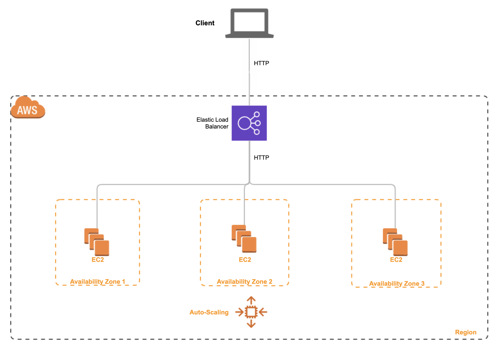
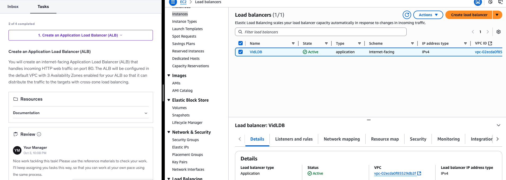
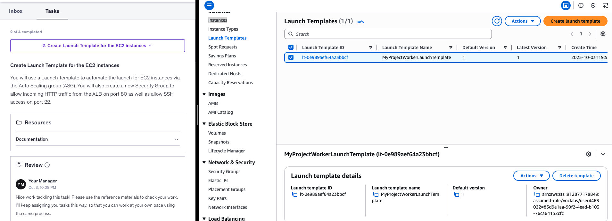
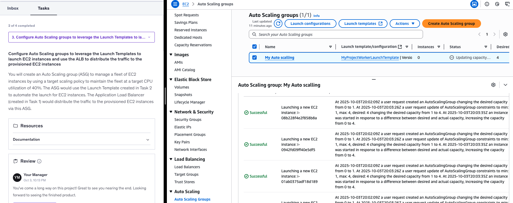
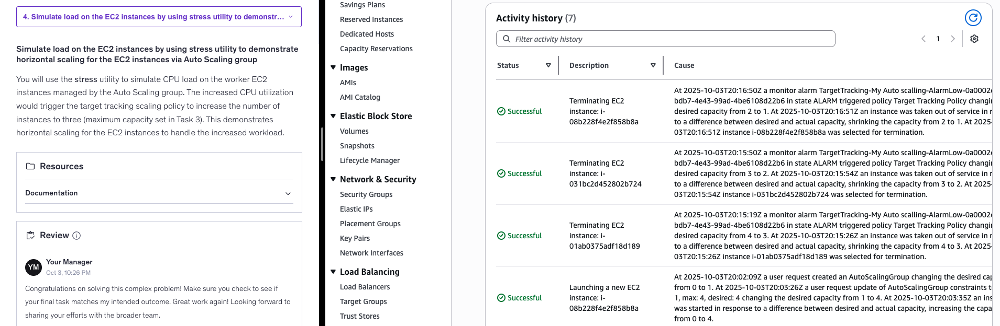

# AWS Auto Scaling behind an Application Load Balancer (ALB)

This project implements **horizontal scaling** on AWS using an **Application Load Balancer (ALB)** in front of an **Auto Scaling Group (ASG)** of EC2 worker instances.  
Goal: keep CPU utilization around a target by **adding/removing EC2 instances automatically** during traffic spikes.

> Lab scenario: A video-sharing service needs worker EC2s to process uploaded videos. During peak hours CPU spikes → we scale out; when idle → scale in.

---

## 🧱 Architecture

- **ALB (internet-facing)** on port 80
- **Target Group** (HTTP health checks)
- **Launch Template** for EC2 workers (user data installs app + stress tool)
- **Auto Scaling Group** across **3 AZs**, target tracking policy on **CPUUtilization**
- **Cross-zone load balancing** enabled



---

## ✅ What I built

1. **Create ALB** and target group (HTTP 80)  
   

2. **Create Launch Template** for worker EC2 instances  
   - Security group allows 80 (from ALB) and 22 (from my IP)  
   

3. **Create Auto Scaling Group** using the Launch Template  
   - Min=0, Desired=1, Max=4  
   - **Target tracking policy**: CPU utilization ~40%  
   

4. **Simulate load** using `stress` utility on the instance to trigger scale-out  
   - ASG increased capacity (1→4) under load and scaled in afterward  
   

---

## 🧪 Reproduce (high level)

1. **ALB & Target Group**: EC2 → Load Balancers → Create (Application)  
2. **Launch Template**: EC2 → Launch Templates → Create  
   - Add user data to install app / stress tool if desired  
3. **ASG**: EC2 → Auto Scaling groups → Create  
   - Attach target group, set Min/Desired/Max  
   - Add **Target tracking** policy on **Average CPU Utilization (40%)**  
4. **Test scaling**  
   - SSH into an instance (or use SSM) and run e.g.:
     ```bash
     sudo amazon-linux-extras install epel -y || true
     sudo yum install -y stress || sudo apt-get install -y stress
     stress --cpu 2 --timeout 300
     ```
   - Watch **Activity history** and **Desired capacity** change.

---

## 🧩 Why this matters

- Demonstrates **elasticity** and **resilience** across multiple AZs  
- Separates **traffic management (ALB)** from **compute capacity (ASG)**  
- Pattern maps to **stateless workers** (thumbnailing, batch jobs, APIs)

---

## 🧠 Lessons learned

- Target tracking on CPU is a **great first policy**; request-rate or SQS-depth can be better for worker fleets.  
- Health checks + graceful draining avoid 5xx during scale-in.  
- Keep security groups tight: ALB SG → instance SG (port 80), SSH only from my IP.  
- Always **clean up** to avoid costs.

---

## 🧹 Cleanup & costs (Free Tier friendly)

- Set ASG desired to 0, then delete ASG and Launch Template  
- Delete Target Group and ALB  
- Remove security groups if unused  
- **Note:** Multi-AZ RDS and EKS are not Free Tier; this project used only ALB + EC2 + ASG.

---

## 📁 Repo

- `screenshots/` evidence of each step  
- `diagrams/` includes architecture diagram  
- `notes/` includes cleanup tips and cost notes

---

## 📣 Author

**Ntwali Irengé** — Building an end-to-end Cloud/DevOps portfolio (AWS + Terraform + Kubernetes).  
Connect with me on linkedin.com/in/ntwali-irenge-bisharhwa
